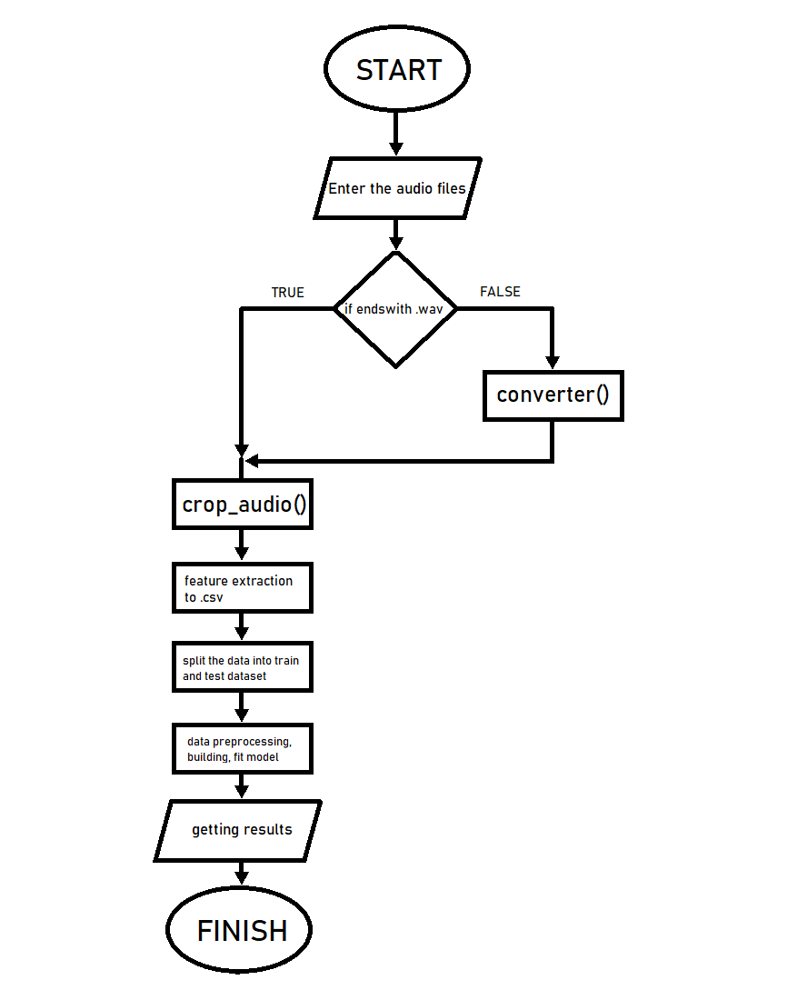
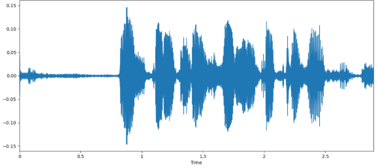
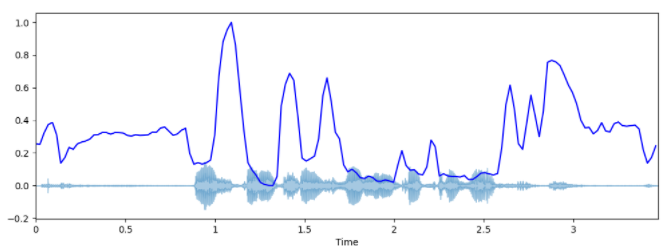
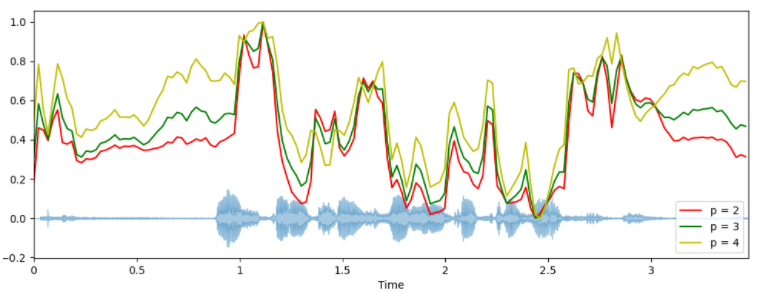
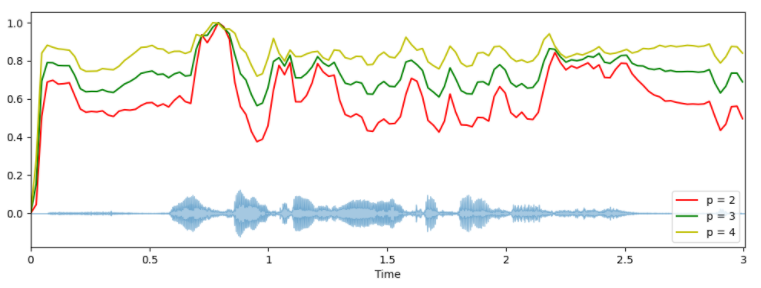
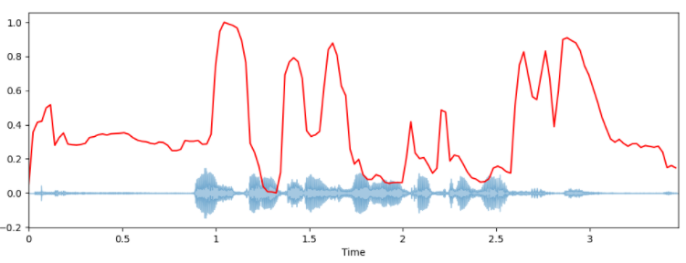
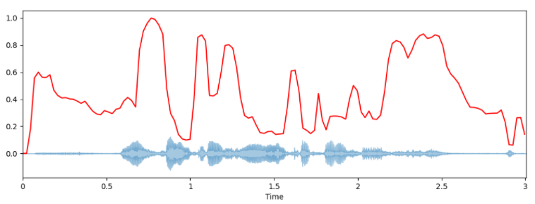

# Student's project - analysis of human voice using Machine Learning
## Trying to recognise when someone is drunk by analyzing his voice

***

**Diagram** --> shows how our program works. 

***

***

**Audio vizualization**

***

> **Sober**

> **Unsober**
***

**Spectograms**

***

> **Left - sober, Right - unsober**

***

**Spectral centroid**

***

> **Sober**

> **Unsober**

***

**Spectral bandwidth**

***

> **Sober**

> **Unsober**

***

**Spectral rolloff**

***

> **Sober**

> **Unsober**

***

**MFCCGs**

***

> **Sober**

> **Unsober**

***

**Chroma feature**

***

> **Sober**

> **Unsober**
